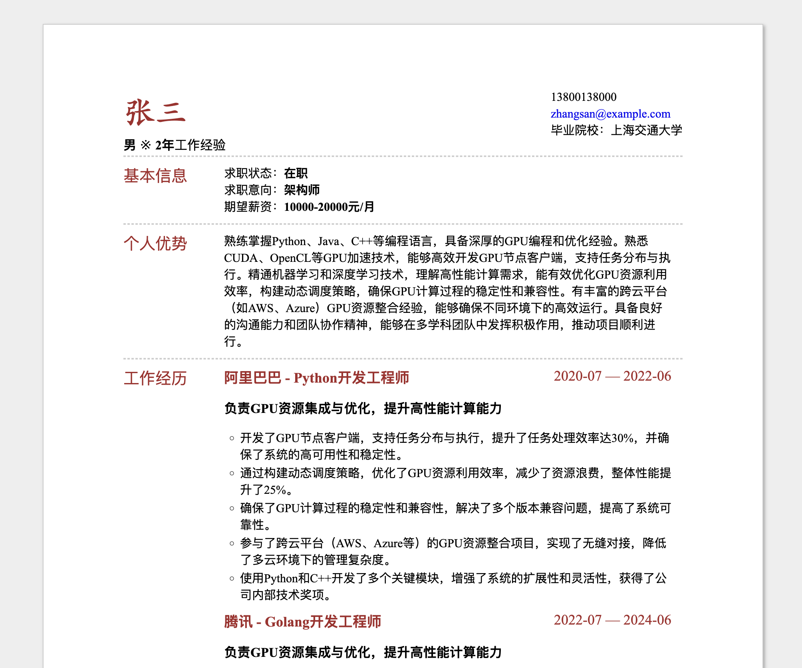

# Curriculum Vitae AI Agent

🤖 人工智能求职助手，有针对性的调整简历，助你快速找到心仪的工作。

🤖 AI Resume Assistant, helping you tailor your resume and find your ideal job quickly.

## Features

- More aligned with practices **within China**
- Analyzes the 3 most important responsibilities from the input job posting link
- Strategically highlights key personal strengths
- Quantifies past work achievements
- ATS (Applicant Tracking System) friendly format
- Customizable resume templates
- Ready-to-use default resume template style
- Supports multiple API integrations
- Supports langsmith observability
- Generate HTML file and PDF file

## Installation

To set up the project locally, follow these steps:

1. **Clone the repository:**

    ```bash
    git clone https://github.com/alphaqiu/curriculum_vitae_ai_agent.git
    cd curriculum_vitae_ai_agent
    ```

2. **Create a virtual environment:**

    ```bash
    python -m venv venv
    ```

3. **Activate the virtual environment:**

    - On Windows:

      ```bash
      venv\Scripts\activate
      ```

    - On macOS and Linux:

      ```bash
      source venv/bin/activate
      ```

4. **Install the required packages:**

    ```bash
    pip install -r requirements.txt
    ```

## Usage

Create a `.env` file in the same directory as `main.py`. The content of the `.env` file should be as follows:

```
# if enable dashscope, uncomment the following line
DASHSCOPE_API_KEY="your-aliyun-tongyi-key"

# if enable openai, uncomment the following line
#OPENAI_API_KEY="openai-api-key or deepseek-api-key"

# if enable langsmith, uncomment the following lines
#LANGCHAIN_API_KEY="langchain-api-key"
#LANGCHAIN_TRACING_V2="true"
#LANGCHAIN_ENDPOINT="https://api.smith.langchain.com"
```

To generate a resume, use the following command:

```bash
python main.py --link "https://example.com/job-description" --config "./data/config.yml"
```

- `--link` or `-l`: The URL of the job description (required).
- `--config` or `-c`: Path to the configuration file (optional, defaults to `./data/config.yml`).

## Generate Example

The resume template has been modified based on 
https://github.com/hoochanlon/jsonresume-theme-mix




## Configuration

The configuration file (`config.yml`) contains settings for the resume generation process, including model usage and file paths. Customize it according to your needs.

The `config.yml` file supports the following key parameters:

- `model`: Specifies the AI model to use for resume generation
  - Currently supports: `qwen-plus` (Alibaba Cloud's Tongyi Qianwen model)
  - This parameter determines which AI service will process your resume

- `task_path`: Specifies the directory path for task-related files
  - Default value: `./data`
  - This directory contains necessary files like templates, configurations, and resume information

Example configuration:
```yaml
model: qwen-plus
task_path: ./data
```

### Resume Information

Resume information file is located at `data/info.yml`, you can customize it or use the default information.

#### Basic Profile (`resume_profile`)
- `name`: Your full name
- `gender`: Your gender
- `age`: Your age
- `email`: Contact email address
- `education_background`: Brief education summary
- `work_experience`: Years of work experience
- `skills`: Key technical skills, separated by commas
- `projects`: Brief project summary
- `awards`: Notable achievements or awards
- `mobile_phone`: Contact phone number
- `job_seeking_status`: Current employment status
- `desired_positions`: List of target positions
  - `position`: Job title
  - `location`: Preferred location
  - `salary`: Expected salary range
  - `industry`: Target industry
  - `employment_type`: Type of employment (e.g., full-time, part-time)

#### Personal Advantages (`personal_advantage`)
List of key strengths and competencies that make you stand out

#### Education Details (`education_details`)
- `school`: Institution name
- `major`: Field of study
- `degree`: Degree type
- `start_date`: Start date (YYYY-MM format)
- `graduation_date`: End date (YYYY-MM format)
- `school_experience`: Notable activities during education
- `graduation_project_topic`: Final project title
- `graduation_project_description`: Project description

#### Work Experience (`work_experience`)
For each position:
- `company`: Company name
- `position`: Job title
- `start_date`: Start date (YYYY-MM format)
- `end_date`: End date (YYYY-MM format)
- `work_experience`: Overall experience summary
- `work_experience_description`: Detailed role description
- `work_experience_achievements`: Key accomplishments
- `work_experience_skills`: Skills utilized
- `work_experience_projects`: Projects involved
- `work_experience_awards`: Awards received
- `tags`: Relevant skill tags

#### Project Experience (`project_experience`)
For each project:
- `project_name`: Project title
- `project_role`: Your role
- `project_start_date`: Start date
- `project_end_date`: End date
- `project_description`: Project overview
- `project_achievements`: Key accomplishments
- `project_link`: Project URL (if applicable)
- `project_skills`: Technologies used

#### Certifications (`qualification_certificate`)
- `certificate_name`: Name of certification
- `certificate_date`: Date obtained
- `certificate_link`: Verification link

#### Volunteer Experience (`volunteer_experience`)
- `volunteer_experience_name`: Activity name
- `start_date`: Start date
- `end_date`: End date
- `service_duration`: Duration of service
- `volunteer_experience_description`: Description of activities

#### Hobbies and Interests (`hobbies_and_interests`)
- `hobbies_and_interests_name`: Interest category
- `hobbies_and_interests_description`: Detailed descriptions

Example:
```yaml
resume_profile:
  name: 'John Doe'
  gender: 'Male'
  age: 20
  email: 'john.doe@example.com'
  education_background: 'Shanghai Jiao Tong University'
  work_experience: '2 years'
  skills: 'Python, Java, C++, Machine Learning, Deep Learning'
  # ... other fields ...

# Additional sections follow the same structure as shown above
```

All fields support both English and Chinese content. Customize the information according to your background and target position.


### Resume Template

Resume template file is located at `data/resume_templates/resume_template.tpl`, you can customize it or use the default template.

The resume template is a simple HTML file that uses Tailwind CSS for styling.

## License

This project is licensed under the MIT License - see the [LICENSE](LICENSE) file for details.
